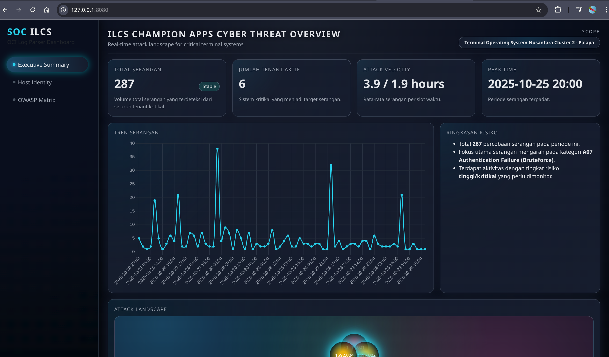
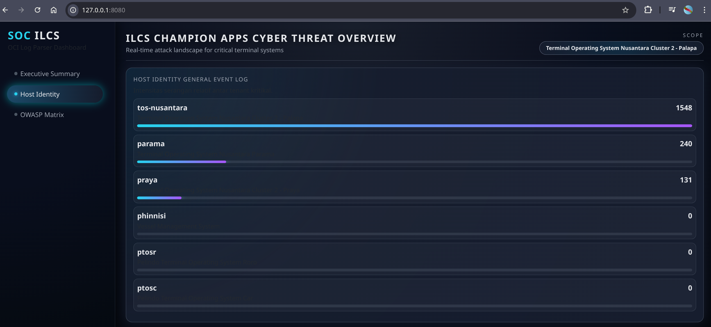

# 🔐 OCI Cyber Monitoring Dashboard  
**Monitoring Threat Intelligence • MITRE ATT&CK Insights • Risk-Based Severity Engine**


Dashboard ini dirancang sebagai **platform visualisasi keamanan siber modern** untuk menganalisis serangan terhadap aplikasi Anda di **Oracle Cloud Infrastructure (OCI)**.  
Menggunakan data dari **OCI Web Application Firewall (WAF)** serta, dashboard ini menyediakan pemantauan analisis risiko otomatis, serta mapping langsung ke **MITRE ATT&CK** dan **OWASP Top 10**.

---

## ✨ Fitur Utama

### 🧠 1. Risk-Based Severity Engine  
Severity ditentukan oleh:
- MITRE ATT&CK technique  
- CVSS score  
- Asset criticality  
- Frequency spike detection  
- Critical keyword detection  

Output: **Low, Medium, High, Critical** (bukan sekedar hitungan volume).

### 🛰️ 2. Executive Summary  
- Total serangan  
- Attack velocity  
- Peak hour analytics  
- Risk highlight automation  
- Cyber Map visualization

### 🏢 3. Tenant Analytics  
- Menampilkan aktivitas serangan berdasarkan hostname  
- Mendukung multi-tenant  
- Bubble-wall visual untuk melihat tenant paling sering diserang

### 📊 4. OWASP & MITRE ATT&CK Breakdown  
- Chart top OWASP category  
- MITRE technique breakdown  
- Tabel detail serangan  
- Timeline per jam  

---

## ⏳ 5. Realtime Monitoring (COMING SOON)  
> Fitur **Realtime Attack Feed** sedang dalam tahap pengembangan.  
> Dashboard akan mendukung:
> - Query otomatis dari **OCI Logging Search API**  
> - Deteksi serangan 60-detik terbaru  
> - Auto-severity via Risk Engine  
> - Live feed style SIEM  
> 
> Fitur ini akan hadir pada rilis berikutnya.

---

## 📸 Screenshots

### 🟦 Executive Summary  


### 🟦 Multi-Tenant Overview  


---

## 📁 Struktur Folder

```bash
/project
├── server.py                 # Backend API
├── severity_engine.py        # Risk-Based Severity Engine
├── oci_realtime_fetcher.py   # Realtime Logging Search connector (TODO)
├── oci_parser_core.py        # Parser untuk file log OCI WAF
├── requirements.txt
│
├── templates/
│   └── dashboard_bod.html    # Main UI HTML
│
├── static/
│   └── js/
│       ├── executive.js      # Executive Summary logic
│       ├── tenants.js        # Tenant Analytics
│       ├── kpi.js            # OWASP + MITRE analytics
│       ├── cyber_map.js      # Cyber Map visualization
│       ├── realtime.js       # Realtime monitoring (TODO)
│       └── utils.js          # Helper functions
│
└── assets/
    └── screenshots/          # Dokumentasi screenshot dashboard
```

---
## 🚀 Installation & Setup

### 1️⃣ Install dependencies
```bash
pip install -r requirements.txt --break-system-packages
```
### 2️⃣ Run dashboard
```bash
python3 server.py --log logs/*.json --debug
```
### 3️⃣ UI Access
```bash
http://localhost:8080
```
---

## 🛠️ Roadmap

- [x] Risk-Based Severity Engine  
- [x] Executive Summary Dashboard  
- [x] OWASP & MITRE Analytics  
- [x] Multi-Tenant Attack Profiling  
- [ ] **Realtime Monitoring (OCI Logging Search Integration)**  
- [ ] MITRE ATT&CK Matrix Heatmap  
- [ ] Threat Correlation Engine  
- [ ] Export PDF Security Report  
- [ ] WebSocket Live Streaming Mode  

## 📜 License

MIT License